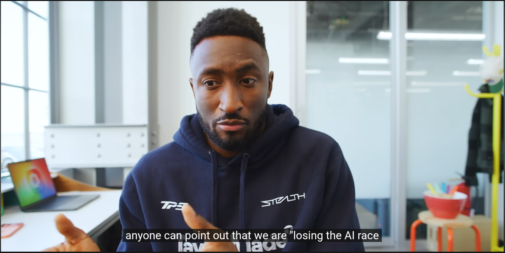

# No CC: Hide YouTube™ Captions & Subtitles

**Automatically turns off YouTube captions and subtitles. Lightweight extension to permanently hide CC.**

[](https://addons.mozilla.org/en-US/firefox/addon/no-cc/)
[](https://www.si4k.online/projects/no-cc)
[](https://microsoftedge.microsoft.com/addons/detail/no-cc-hide-youtube%E2%84%A2-capt/mepafpplfgjffahdcmmilgnfbpfpfmbn)

---

## Features

- **~8 KB total**   ultra lightweight
- **One-click toggle**   ON/OFF from popup or in-player button
- **Replaces YouTube's CC button**   hides the default and puts our smart button in its place
- **Remembers your choice forever**   persists across tabs, sessions, and page reloads (unlike YouTube's default CC)
- **Direct caption control**   toggle OFF = captions turn on, toggle ON = captions turn off. One button, no confusion
- **Works everywhere**   videos, shorts, reels, home page hover previews
- **Zero performance hit**   debounced MutationObserver, no polling loops
- **100% Open Source**   audit the code yourself

---

## Demo

| Before (Cluttered 🤮) | After (Clean ✨) |
| :---: | :---: |
|  |  |

---

## What It Does

- Turn off YouTube captions automatically
- Remove subtitles from YouTube Shorts
- **Replace** YouTube's CC button with a smarter **No CC** button that remembers your preference
- Disable auto-generated captions
- Stop YouTube subtitles from turning on

---

## Install

### Chrome / Edge / Brave
1. Download from the [project page](https://www.si4k.online/projects/no-cc)
2. Go to `chrome://extensions`
3. Enable **Developer mode**
4. Click **Load unpacked** → select the `chrome/` or `edge/` folder

### Firefox
1. Download from the [project page](https://www.si4k.online/projects/no-cc)
2. Go to `about:debugging#/runtime/this-firefox`
3. Click **Load Temporary Add-on**
4. Select `firefox/manifest.json`

---

## Browser Folders

```
├── chrome/      # Chrome & Chromium (Manifest V3)
├── edge/        # Microsoft Edge (Manifest V3)
└── firefox/     # Firefox (Manifest V2 + Gecko)
```

---

## Source

```
├── manifest.json   # Extension config
├── content.js      # Caption killer logic (debounced + throttled)
├── popup.html      # Toggle UI with links
├── popup.js        # Toggle handler + storage
└── icon.svg        # Extension icon
```

---

## Privacy

This extension collects **zero data**. No analytics, no tracking, no external requests.

[Privacy Policy](https://www.si4k.online/projects/no-cc/privacy)

---

## License

MIT   do whatever you want.

---

## Links

- [Homepage](https://www.si4k.online/projects/no-cc)
- [Privacy Policy](https://www.si4k.online/projects/no-cc/privacy)
- ☕ [Buy Me A Coffee](https://www.buymeacoffee.com/akshitkamboz13)
